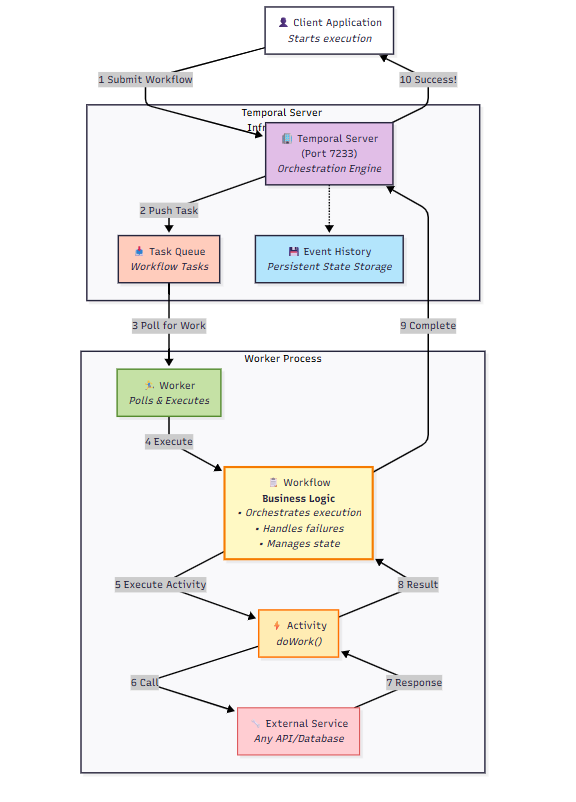
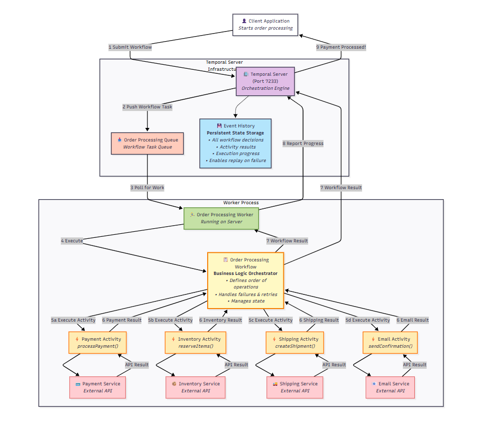
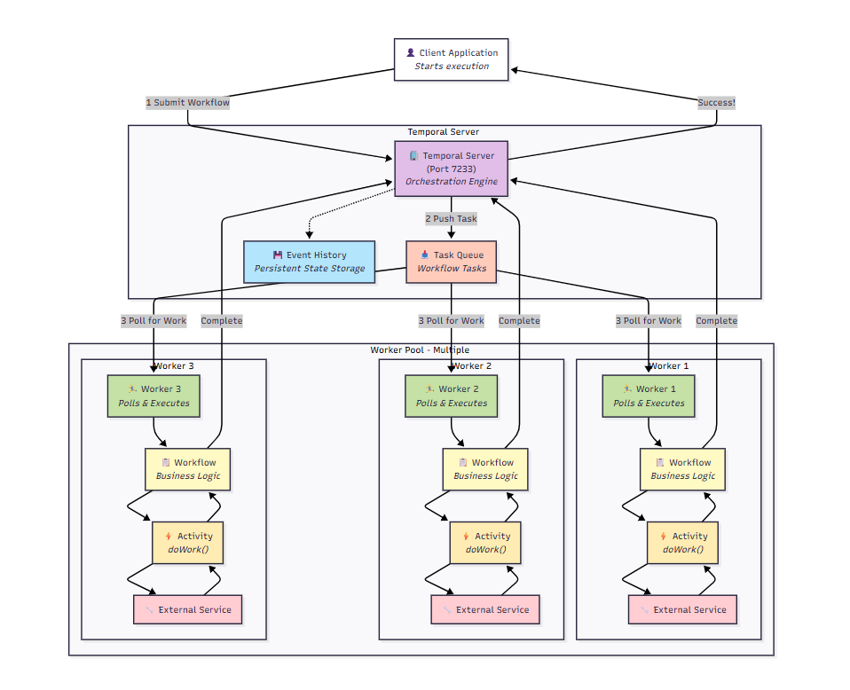

# Temporal Orchestration Platform

## 🎯 What You'll Learn

By the end of this guide, you'll understand:
- What orchestration means and why it's essential
- How Temporal works and what makes it special
- The key components and how they interact
- When and why to use Temporal for your projects

---

## 1. What is Orchestration?

**Orchestration** in software refers to the automated coordination, management, and arrangement of complex computer systems, middleware, and services. It ensures that multiple tasks, services, or processes work together in a defined sequence to achieve a specific business or technical goal. Orchestration handles dependencies, error recovery, and the flow of data between components.

**Workflow Orchestration** is a specialized form of orchestration focused on managing and automating business processes or workflows. It defines the order of operations, decision points, error handling, and the coordination of tasks (which may be manual or automated) across different systems or teams. Workflow orchestration platforms like Temporal provide tools to model, execute, monitor, and manage these workflows reliably and at scale.

### 🎭 Think of It Like a Symphony Orchestra

Imagine you're conducting a symphony orchestra with 100+ musicians. Each musician plays their instrument (individual task), but someone needs to:
- **Coordinate timing** - ensure violins start before drums
- **Handle mistakes** - if a musician misses their cue, restart that section
- **Manage the flow** - know which movement comes next
- **Adapt to problems** - if a violin breaks, reassign the part

That **conductor** is what **orchestration** does for your software systems.

### 🔧 Why Automation Alone Isn't Enough

**Simple Automation** (like cron jobs):
```
09:00 AM → Run Task A
09:15 AM → Run Task B  
09:30 AM → Run Task C
```

**Problems with Simple Automation:**
- ❌ What if Task A fails? Task B runs anyway with bad data
- ❌ What if Task A takes 20 minutes instead of 15? Task B starts too early
- ❌ What if the server crashes? You lose track of progress
- ❌ No coordination between tasks running on different servers

**Orchestration** solves these problems by:
- ✅ **Dependency Management** - Task B waits for Task A to complete successfully
- ✅ **Error Handling** - Automatically retry failed tasks or redirect to alternatives
- ✅ **State Tracking** - Always knows what's running, what's done, what failed
- ✅ **Distributed Coordination** - Manages tasks across multiple servers

### 🌟 Real-World Orchestration Examples

| Platform | What It Orchestrates | Example |
|----------|---------------------|---------|
| **Kubernetes** | Container deployment and scaling | "Run 3 copies of my web app, restart if they crash" |
| **Docker Swarm** | Container clusters | "Distribute these containers across 5 servers" |
| **Temporal** | Business processes and workflows | "Process this order: validate payment → reserve inventory → ship → send confirmation" |

---

## 2. What is Temporal?

**Temporal** is an open-source workflow orchestration platform that enables developers to build reliable, scalable, and maintainable applications. It provides a programming model where developers write workflows as code using familiar programming languages (Python, Java, Go, TypeScript, etc.), while Temporal handles the complex distributed systems challenges like fault tolerance, retries, state management, and scaling automatically.

### 🏗️ Temporal is Your Digital Process Manager

Think of Temporal as a **super-intelligent project manager** for your software that:
- Never forgets what needs to be done
- Can coordinate work across multiple teams (servers)
- Automatically handles problems and retries
- Keeps detailed records of everything that happens
- Can pause work and resume exactly where it left off

### 🧩 Core Components

Temporal has three main building blocks - think of them like a construction project:

#### 1. **Workflows** - The Blueprint 📋
Like an architect's blueprint, a workflow defines:
- What steps need to happen
- In what order
- What to do if something goes wrong
- How different parts connect together

```python
# Example: Online Order Processing Workflow
def process_order(order_data):
    # Step 1: Validate payment
    payment_result = validate_payment(order_data.payment_info)
    
    # Step 2: Reserve inventory (only if payment worked)
    if payment_result.success:
        inventory_result = reserve_inventory(order_data.items)
    
    # Step 3: Ship order (only if inventory available)
    if inventory_result.available:
        shipping_result = ship_order(order_data)
    
    # Step 4: Send confirmation
    send_confirmation_email(order_data.customer_email)
```

#### 2. **Activities** - The Individual Tasks 🔨
Like construction workers with specific jobs:
- **Payment Validation Activity** - "I only handle payment processing"
- **Inventory Activity** - "I only check and reserve inventory"
- **Shipping Activity** - "I only handle shipping logistics"
- **Email Activity** - "I only send emails"

```python
# Each activity is a specialist
@activity.defn
async def validate_payment(payment_info):
    # Connects to payment gateway
    # Returns success/failure
    pass

@activity.defn  
async def reserve_inventory(items):
    # Checks warehouse database
    # Reserves items if available
    pass
```

#### 3. **Workers** - The Execution Engines 🏃‍♂️
Like construction crews that can build multiple projects:
- **Workers** are processes that execute workflows and activities
- One worker can handle multiple different types of work
- Workers can run on different servers/locations
- If a worker goes down, others can take over its work

### 🔄 How Components Work Together

**Generalized Component Relationships:**


**Real-World Example - E-commerce Order Processing:**


---

## 3. Why Temporal?

### 💪 The Four Superpowers

#### 1. **Durability** - Never Loses Your Work 💾

**The Problem:**
Your server crashes in the middle of processing a $10,000 order. With traditional systems, you might lose track of:
- Whether payment was processed
- If inventory was reserved
- What step you were on

**Temporal's Solution:**
```
Step 1: Payment validated ✅ [SAVED]
Step 2: Inventory reserved ✅ [SAVED]  
Step 3: Shipping started... 💥 [SERVER CRASH]
Step 4: Email pending ⏳

[SERVER RESTARTS]
Temporal: "I see we were at Step 3. Let me continue shipping..."
Step 3: Shipping completed ✅ [SAVED]
Step 4: Email sent ✅ [SAVED]
```

Temporal uses **event sourcing** - it saves every single thing that happens, so it can always resume exactly where it left off.

#### 2. **Reliability** - Handles Failures Gracefully 🛡️

**Example: External Service Failures**
```python
# Payment service is temporarily down
@activity.defn
async def validate_payment(payment_info):
    try:
        return payment_service.charge(payment_info)
    except ServiceDownError:
        # Temporal automatically retries this activity
        # with exponential backoff: 1s, 2s, 4s, 8s...
        raise  # Let Temporal handle the retry
```

**Temporal automatically:**
- Retries failed activities with smart backoff
- Routes work around failed servers
- Maintains data consistency
- Provides detailed failure information

#### 3. **Scalability** - Grows With Your Business 📈

**Single Server Setup (Small Business):**
```
[Server 1]
├── Temporal Server
├── Worker Process
└── Your Application
```

**Multi-Server Setup (Growing Business):**
```
[Server 1: Temporal Server]
[Server 2: Worker + Payment Service]  
[Server 3: Worker + Inventory Service]
[Server 4: Worker + Shipping Service]
[Server 5: Worker + Email Service]
```

Workers can be added/removed dynamically based on load.

#### 4. **Distributed Processing** - Works Across Multiple Systems 🌐

**Example: Global E-commerce Platform**
```
Workflow: Process International Order

[US Server] → Validate payment in USD
[EU Server] → Check European warehouse  
[Asia Server] → Calculate shipping from Singapore
[US Server] → Send confirmation email

All coordinated by Temporal automatically!
```

### 🎯 Perfect Use Cases

| Use Case | Why Temporal Excels | Traditional Approach Problems |
|----------|-------------------|----------------------------|
| **Long-running Processes** | Can run for days/months without losing state | Cron jobs fail if they take too long |
| **Microservice Orchestration** | Coordinates calls across 50+ services | Hard to track what failed where |
| **Data Pipelines** | Handles dependencies and retries | One failure breaks entire pipeline |
| **Business Workflows** | Models complex business rules naturally | State machines become unmaintainable |

---

## 4. Architecture Deep Dive

### 4.1 Single Worker Setup

In a single worker setup, everything runs on one machine - perfect for getting started or small applications.

**📊 Single Worker Architecture** (see diagram above)

**How It Works:**
1. **Client** starts a workflow by sending a request to Temporal Server
2. **Temporal Server** queues the workflow task
3. **Worker** polls the task queue and picks up the workflow
4. **Worker** executes the workflow logic step by step
5. **Worker** executes activities (like API calls) as needed
6. **Results** flow back to Temporal Server
7. **Event Store** saves every step for durability

**When to Use Single Worker:**
- ✅ Development and testing
- ✅ Small applications with low traffic
- ✅ Proof of concepts
- ✅ Simple workflows with few activities

**Example Configuration:**
```python
# Single worker handling all tasks
worker = Worker(
    client,
    task_queue="main-task-queue",
    workflows=[OrderWorkflow, UserWorkflow, PaymentWorkflow],
    activities=[validate_payment, reserve_inventory, send_email]
)
```

### 4.2 Multiple Worker Setup

As your business grows, you need multiple workers to handle increased load and provide better fault tolerance.

**📊 Multiple Worker Architecture**


**Key Benefits:**
- **🚀 Higher Throughput** - Process multiple orders simultaneously
- **🛡️ Fault Tolerance** - If Payment Worker fails, other workers continue
- **⚖️ Load Distribution** - No single point of failure
- **🎯 Specialization** - Each worker can be optimized for specific tasks

**Real-World Example:**
```python
# Payment Worker (Server 1) - Specialized for financial operations
payment_worker = Worker(
    client,
    task_queue="payment-queue",
    activities=[validate_payment, process_refund, charge_card]
)

# Inventory Worker (Server 2) - Optimized for warehouse operations  
inventory_worker = Worker(
    client,
    task_queue="inventory-queue", 
    activities=[check_stock, reserve_items, update_inventory]
)

# Shipping Worker (Server 3) - Handles logistics
shipping_worker = Worker(
    client,
    task_queue="shipping-queue",
    activities=[calculate_shipping, create_label, track_package]  
)

# Email Worker (Server 4) - Manages communications
email_worker = Worker(
    client,
    task_queue="email-queue",
    activities=[send_confirmation, send_tracking, send_receipt]
)
```

**Scaling Strategy:**
```
Black Friday Traffic Surge:
├── Payment Queue: 3 workers (high demand)
├── Inventory Queue: 2 workers (moderate demand)  
├── Shipping Queue: 4 workers (peak demand)
└── Email Queue: 1 worker (low demand)

Add/remove workers based on queue depth!
```

### 4.3 How Multiple Workers Collaborate
<!-- 
The magic happens in how workers coordinate without stepping on each other's toes.


**📊 Task Queue Mechanism**

#### 🎯 Task Queue Mechanism

Think of task queues like **specialized help desks** at a large company:

**📞 Customer Service Analogy:**
```
Company Call Center:
├── 📞 Billing Queue → Billing specialists answer
├── 🔧 Technical Queue → Tech specialists answer  
├── 💰 Sales Queue → Sales reps answer
└── 📋 General Queue → Anyone can answer
```

**🏢 Temporal Implementation:**
```python
# How workers "raise their hand" for specific work
payment_worker = Worker(
    client,
    task_queue="payment-queue",  # "I only handle payment tasks"
    activities=[validate_payment, process_refund]
)

inventory_worker = Worker(
    client, 
    task_queue="inventory-queue",  # "I only handle inventory tasks"
    activities=[check_stock, reserve_inventory]
)
```

#### ⚖️ Work Distribution

**Polling Mechanism** - Workers constantly ask "Got any work for me?"
```
Every 1-2 seconds:
Worker 1: "Any payment tasks?" → Temporal: "Here's one!"
Worker 2: "Any payment tasks?" → Temporal: "Queue is empty"  
Worker 3: "Any shipping tasks?" → Temporal: "Here are three!"
```

**Load Balancing Strategy:**
- **Fastest Available** - Tasks go to workers that respond quickest
- **Round Robin** - Tasks distributed evenly among available workers
- **Least Loaded** - Tasks go to workers with lightest current load

#### 🛡️ Fault Tolerance

**What Happens When Workers Fail:**

**🚨 Scenario: Payment Worker Crashes**
```
Step 1: Process Order #12345
├── ✅ Inventory checked and reserved
├── 🔄 Payment validation in progress...
├── 💥 Payment worker crashes mid-task
└── ⏳ Shipping waiting for payment confirmation

Temporal Response:
├── 🔍 Detects worker hasn't responded in 30 seconds
├── 📤 Reassigns payment task to another payment worker  
├── 🔄 New worker picks up exactly where old worker left off
└── ✅ Order processing continues seamlessly
```

**Task Reassignment Logic:**
1. **Heartbeat Monitoring** - Workers send "I'm alive" signals every 30 seconds
2. **Timeout Detection** - If no heartbeat for 60 seconds, worker presumed dead
3. **Automatic Reassignment** - Task immediately goes back to queue
4. **State Preservation** - New worker gets full context of what was happening

#### 🔄 Real-Time Collaboration Example

**Complex Order Processing Workflow:**
```python
@workflow.defn
class OrderWorkflow:
    async def run(self, order_data):
        # These activities run on DIFFERENT workers automatically
        
        # Step 1: Validate payment (Payment Worker)
        payment_result = await workflow.execute_activity(
            validate_payment,
            order_data.payment,
            task_queue="payment-queue"  # Specifically routed to payment workers
        )
        
        # Step 2: Reserve inventory (Inventory Worker)  
        inventory_result = await workflow.execute_activity(
            reserve_inventory,
            order_data.items,
            task_queue="inventory-queue"  # Routed to inventory workers
        )
        
        # Step 3: Calculate shipping (Shipping Worker)
        shipping_result = await workflow.execute_activity(
            calculate_shipping,
            order_data.address,
            task_queue="shipping-queue"  # Routed to shipping workers
        )
        
        # Step 4: Send confirmation (Email Worker)
        await workflow.execute_activity(
            send_confirmation,
            order_data.email,
            task_queue="email-queue"  # Routed to email workers
        )
```

**🌐 What This Looks Like In Action:**
```
Order #12345 Processing Timeline:

09:00:00 - Order started (Workflow Worker, Server 1)
09:00:01 - Payment validation (Payment Worker, Server 2) 
09:00:03 - Payment approved ✅
09:00:03 - Inventory check (Inventory Worker, Server 3)
09:00:05 - Items reserved ✅  
09:00:05 - Shipping calculation (Shipping Worker, Server 4)
09:00:07 - Shipping cost calculated ✅
09:00:07 - Email sending (Email Worker, Server 5)
09:00:09 - Confirmation sent ✅
09:00:09 - Order completed 🎉

All coordinated automatically by Temporal!
```

--- -->

## 5. Component Interactions
<!-- 
Understanding how all the pieces fit together is crucial for building robust Temporal applications.


**📊 Complete System Architecture**

### 🔧 Core Components Explained

#### 🏢 Temporal Server (Port 7233)
The brain of the operation - like a **smart traffic control center**:

**Internal Services:**
- **📋 Frontend Service** - API gateway that receives all requests
- **⚙️ Matching Service** - Traffic cop that assigns tasks to workers
- **📚 History Service** - Librarian that records everything that happens
- **🌐 Web UI (Port 8233)** - Dashboard for monitoring and debugging

#### 📡 Client SDK  
Your application's **translator** that speaks Temporal:
- **Converts** your Python/Java/Go code into Temporal commands
- **Manages** gRPC connections to Temporal Server
- **Handles** authentication and error handling
- **Provides** workflow and activity decorators

#### 🏃‍♂️ Worker Processes
The **hands-on workers** that do the actual work:
- **Poll** task queues for work ("Got anything for me?")
- **Execute** workflow and activity code
- **Report** results back to Temporal Server
- **Handle** failures and retries automatically

#### 📋 Task Queues
**Smart waiting lines** for different types of work:
- **Route** tasks to appropriate workers
- **Provide** load balancing and fault tolerance
- **Enable** scaling (add more workers = faster processing)
- **Maintain** task ordering when needed

#### 💾 Database Storage
Temporal's **memory bank** (PostgreSQL, MySQL, or Cassandra):
- **Stores** workflow history and state
- **Enables** durability and recovery
- **Provides** event sourcing capabilities
- **Supports** queries and monitoring

### 🔄 Communication Flow

**🌟 Step-by-Step Interaction:**

1. **Application Start** 
   ```python
   # Your application starts a workflow
   client.start_workflow(OrderWorkflow.run, order_data)
   ```

2. **Client SDK Translation**
   ```
   Client SDK → gRPC request → Temporal Server
   "Please start OrderWorkflow with this data"
   ```

3. **Server Processing**
   ```
   Frontend Service → Matching Service → Task Queue
   "Add workflow task to appropriate queue"
   ```

4. **Worker Polling**
   ```
   Worker → "Any tasks for me?" → Matching Service
   "Here's a workflow task!" → Worker
   ```

5. **Execution & Results**
   ```
   Worker executes → Results → History Service → Database
   "Save progress, request next activity"
   ```

6. **Activity Execution** 
   ```
   Activity tasks → Specialized workers → External services
   Payment API, Inventory DB, Shipping Service, etc.
   ```

### 🌐 Communication Protocols

**gRPC (Port 7233)** - The "telephone system" between components:
- **High Performance** - Binary protocol, faster than REST
- **Bi-directional** - Supports streaming and real-time updates  
- **Type Safe** - Strongly typed contracts between services
- **Cross-Language** - Works with Python, Java, Go, .NET, etc.

**Why gRPC vs HTTP REST?**
```
REST API: "Send letter, wait for response"
├── Request → Process → Response
└── Each call is independent

gRPC: "Phone conversation" 
├── Persistent connection
├── Streaming updates
├── Lower latency
└── Better for real-time coordination
``` -->

---

## 7. Advanced Topics

### 🏢 Namespaces

Think of namespaces like **separate departments** in a large company:

```python
# Production workflows
production_client = Client.connect(
    "temporal.company.com:7233",
    namespace="production"
)

# Development workflows  
dev_client = Client.connect(
    "temporal.company.com:7233", 
    namespace="development"
)

# Testing workflows
test_client = Client.connect(
    "temporal.company.com:7233",
    namespace="testing"
)
```

**Benefits:**
- **🔒 Isolation** - Dev workflows can't interfere with production
- **👥 Multi-tenancy** - Different teams/customers get separate spaces
- **🎯 Resource Control** - Set different resource limits per namespace
- **📊 Monitoring** - Track metrics separately for each namespace

### 🌐 Cross-Namespace Communication

**Scenario: Multi-tenant SaaS Application**
```python
# Customer A's workflow (namespace: customer-a)
@workflow.defn
class CustomerOrderWorkflow:
    async def run(self, order_data):
        # Process customer A's order
        result = await workflow.execute_activity(process_order, order_data)
        
        # Trigger shared billing workflow (namespace: billing)
        await workflow.execute_child_workflow(
            BillingWorkflow.run,
            result.billing_data,
            namespace="billing"  # Cross-namespace child workflow
        )
```

### 📈 Scaling Strategies

#### Horizontal Scaling (Add More Workers)
```bash
# Black Friday preparation - scale up
Docker: docker-compose up --scale payment-worker=10
Kubernetes: kubectl scale deployment payment-worker --replicas=10
AWS: Auto Scaling Groups with Temporal workers
```

#### Vertical Scaling (Bigger Machines)
```yaml
# More powerful worker machines
worker_config:
  cpu: 8 cores     # was 2 cores
  memory: 16GB     # was 4GB  
  max_activities: 100  # was 20
```

#### Geographic Distribution
```
Global E-commerce Setup:
├── US East: Temporal Cluster + Workers
├── EU West: Temporal Cluster + Workers  
├── Asia Pacific: Temporal Cluster + Workers
└── Cross-region replication for disaster recovery
```

### ⚡ Performance Optimization

#### Worker Optimization
```python
# Optimized worker configuration
worker = Worker(
    client,
    task_queue="high-performance-queue",
    max_concurrent_activities=100,        # More parallel activities
    max_concurrent_workflow_tasks=50,     # More parallel workflows
    max_heartbeat_rate_interval=1,        # Faster heartbeats
    max_activities_per_second=1000        # Higher throughput
)
```

#### Activity Optimization
```python
@activity.defn
async def optimized_activity(data):
    # Use connection pooling
    async with http_client_pool.get_connection() as client:
        # Batch multiple operations
        results = await client.batch_request([
            operation1(data.part1),
            operation2(data.part2), 
            operation3(data.part3)
        ])
    return results
```

#### Workflow Optimization
```python
@workflow.defn  
class OptimizedWorkflow:
    async def run(self, orders):
        # Process multiple orders in parallel
        tasks = []
        for order in orders:
            task = workflow.execute_activity(
                process_order, 
                order,
                task_queue="specialized-queue"
            )
            tasks.append(task)
        
        # Wait for all to complete
        results = await asyncio.gather(*tasks)
        return results
```

---

## 🎯 Quick Start Guide

Ready to try Temporal? Here's how to get started:

### 1. **Install Temporal**
```bash
# Using Docker (easiest)
git clone https://github.com/temporalio/docker-compose.git
cd docker-compose
docker-compose up

# Access Web UI: http://localhost:8233
```

### 2. **Write Your First Workflow**
```python
from temporalio import workflow, activity

@activity.defn
async def greet(name: str) -> str:
    return f"Hello, {name}!"

@workflow.defn
class GreetingWorkflow:
    @workflow.run
    async def run(self, name: str) -> str:
        return await workflow.execute_activity(
            greet, name, start_to_close_timeout=timedelta(seconds=10)
        )
```

### 3. **Run a Worker**
```python
import asyncio
from temporalio.client import Client
from temporalio.worker import Worker

async def main():
    client = await Client.connect("localhost:7233")
    worker = Worker(client, task_queue="greeting-tasks", 
                   workflows=[GreetingWorkflow], activities=[greet])
    await worker.run()

if __name__ == "__main__":
    asyncio.run(main())
```

### 4. **Start a Workflow**
```python
import asyncio
from temporalio.client import Client

async def main():
    client = await Client.connect("localhost:7233")
    result = await client.execute_workflow(
        GreetingWorkflow.run, "World", 
        id="my-workflow-id", task_queue="greeting-tasks"
    )
    print(f"Result: {result}")

if __name__ == "__main__":
    asyncio.run(main())
```

---

## 🤔 When to Use Temporal?

### ✅ Perfect For:
- **Long-running processes** (minutes to months)
- **Complex business workflows** with multiple steps
- **Microservice orchestration** across many services
- **Data pipelines** with dependencies and error handling
- **Financial transactions** requiring reliability
- **User onboarding flows** with multiple touchpoints
- **Order processing** systems
- **Batch job coordination**

### ❌ Not Ideal For:
- **Simple REST API calls** (use regular HTTP)
- **Real-time gaming** (too much overhead)  
- **Simple automation** (cron jobs are simpler)
- **Low-latency requirements** (microsecond response times)

---

## 📚 Next Steps

1. **📖 Try the Tutorials** - Start with official Temporal tutorials
2. **🛠️ Build a Demo Project** - Create a simple order processing workflow  
3. **📊 Explore the Web UI** - Monitor workflows and understand the dashboard
4. **🤝 Join the Community** - Temporal Slack, GitHub discussions
5. **📈 Learn Advanced Patterns** - Saga patterns, event sourcing, etc.

**Congratulations!** 🎉 You now understand how Temporal works and can start building reliable, scalable workflows for your applications!
